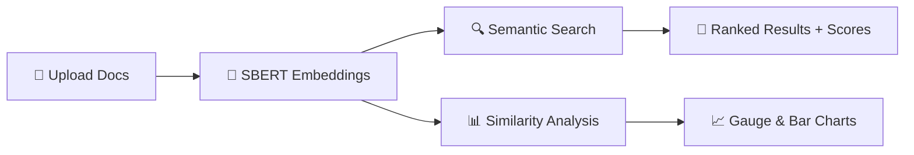

# 🔍 **Semantic Search Engine**

> 🚀 *An intelligent, visually stunning Streamlit app for document search and text similarity — powered by Sentence-BERT (SBERT).*


---

## 🌟 **Overview**

The **Semantic Search Engine** transforms how you explore, analyze, and compare textual data.
Simply upload files (📄 TXT, 🧾 CSV, 📘 PDF) or input text manually, and perform **semantic search**, **text similarity**, and **embedding visualization** — all from an elegant Streamlit interface.

Try out: https://sentencetransformerencoderapp-gbqnwgnvxou5qwccjhyjr2.streamlit.app/

💡 Powered by **SentenceTransformer** models from Hugging Face, this app brings **context-aware search** and **semantic understanding** to your fingertips.

---

## ✨ **Key Features**

| Feature                          | Description                                                |
| -------------------------------- | ---------------------------------------------------------- |
| ⚙️ **Model Selection**           | Choose between MiniLM, MPNet, and Multi-QA encoders        |
| 📁 **Multi-format Upload**       | Upload TXT, CSV, or PDF documents                          |
| 🧠 **Semantic Embeddings**       | Uses SBERT models for vector encoding                      |
| 🔍 **Semantic Search**           | Query your data and get contextually similar results       |
| 📊 **Interactive Visualization** | Plotly charts for similarity and result scores             |
| 🧮 **Text-to-Text Similarity**   | Compare any two sentences with cosine similarity           |
| 🧰 **Streamlit UI**              | Modern, responsive interface with gradients and animations |

---

## 🚀 **Live Demo**

> 🎯 Try the app instantly:
> **🔗 [Click to Launch App on Streamlit Cloud](https://your-streamlit-app-url.streamlit.app)**

*(Replace with your actual app URL once deployed)*

---

## 🛠️ **Installation**

Clone the repository and install dependencies:

```bash
git clone https://github.com/yourusername/semantic-search-engine.git
cd semantic-search-engine
pip install -r requirements.txt
```

---

## ▶️ **Run the App**

Launch your Streamlit app locally:

```bash
streamlit run semantic_app.py
```

Then open [http://localhost:8501](http://localhost:8501) in your browser. 🌐

---

## 🧩 **Supported Models**

| Model Name                  | Speed    | Accuracy | Use Case                   |
| --------------------------- | -------- | -------- | -------------------------- |
| `all-MiniLM-L6-v2`          | ⚡ Fast   | ⭐⭐       | General semantic search    |
| `all-mpnet-base-v2`         | ⚡ Medium | ⭐⭐⭐      | High-accuracy similarity   |
| `multi-qa-MiniLM-L6-cos-v1` | ⚡ Fast   | ⭐⭐       | Q&A and document retrieval |

---

## 📂 **File Formats Supported**

* 📝 `.txt` — Plain text files
* 🧾 `.csv` — CSV with selectable text column
* 📘 `.pdf` — Extracts text via **PyPDF2**

---

## 🧠 **How It Works**

1. **Upload Documents** → TXT, CSV, or PDF
2. **Generate Embeddings** using SentenceTransformer
3. **Search or Compare Texts** using cosine similarity
4. **Visualize Results** with interactive Plotly charts



---

## 💻 **Tech Stack**

* **Frontend**: Streamlit
* **Backend**: SentenceTransformer (SBERT)
* **Visualization**: Plotly
* **PDF Parsing**: PyPDF2
* **Language**: Python 3.9+

---

## 📸 **App Preview**


---

## 🧾 **Sample Use Cases**

* 🔬 Research Literature Search
* 📚 Educational Document Retrieval
* 💬 Customer Support FAQs
* 📰 News Article Similarity
* 🧠 AI-Powered Knowledge Base

---

## 💬 **Example Query**

> Query: `"How is AI transforming healthcare?"`
> Returns top 5 most contextually relevant sentences across uploaded documents.
> Visualized via similarity bars for interpretability.

---

## 🌈 **UI Highlights**

* Gradient titles (`linear-gradient(90deg, #667eea 0%, #764ba2 100%)`)
* Styled buttons & cards
* Sidebar model selection
* Progress & metric indicators
* Animated bar charts and gauges

---

## ⚙️ **Configuration**

Modify `semantic_app.py` to:

* Add new models
* Customize top-k results
* Adjust similarity threshold
* Change visualization style

---

## 🤝 **Contributing**

Pull requests are welcome!
If you’d like to improve the UI, add models, or integrate RAG pipelines — go ahead 🎨

---

## 📜 **License**

This project is licensed under the **MIT License** — free to use and modify.

---
